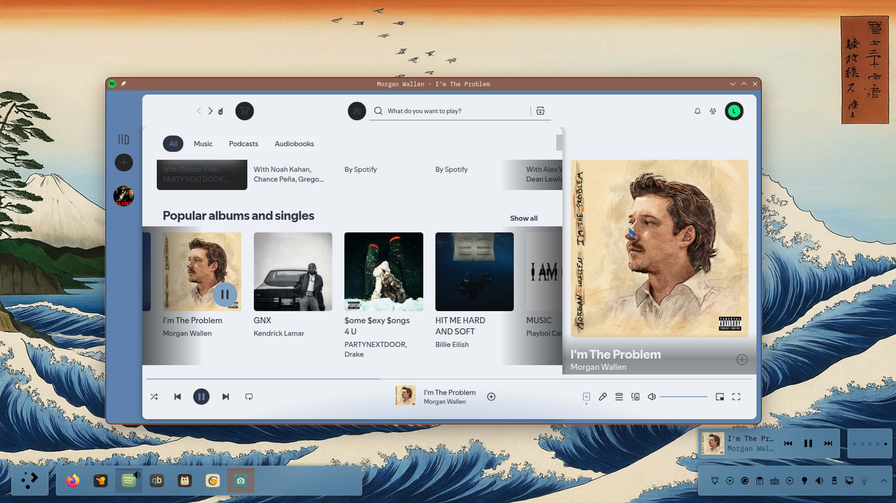
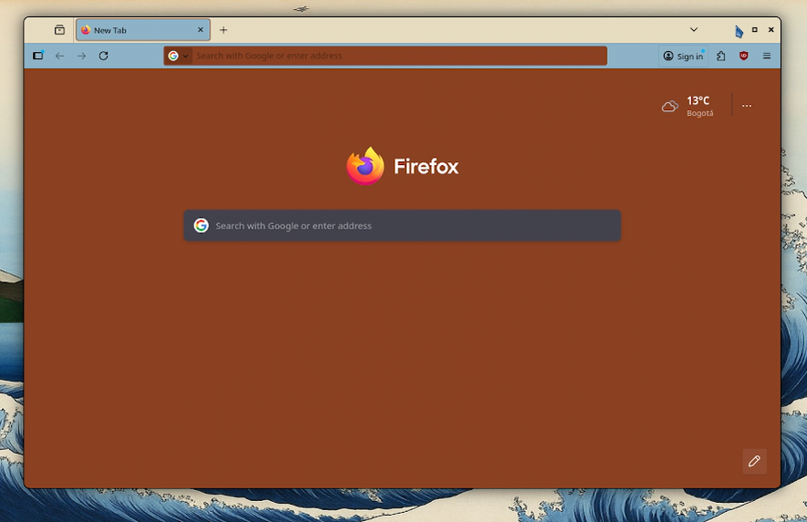
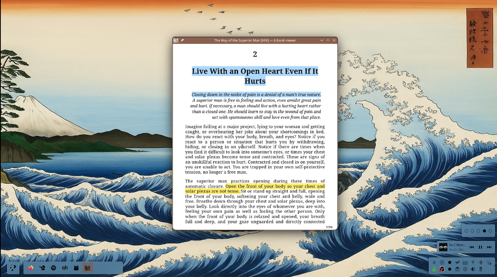
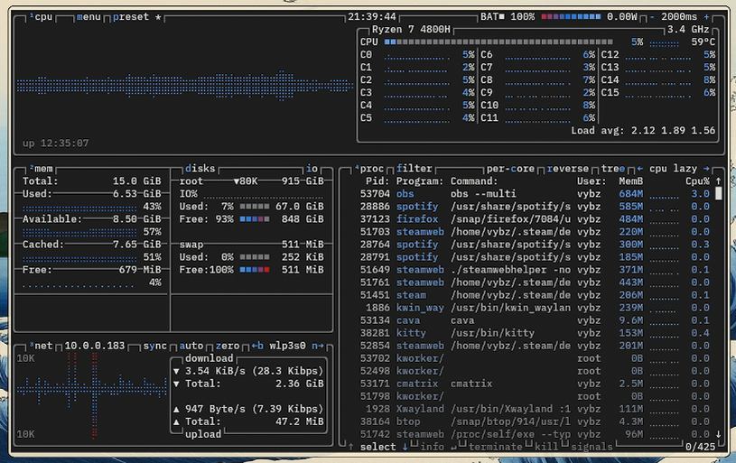
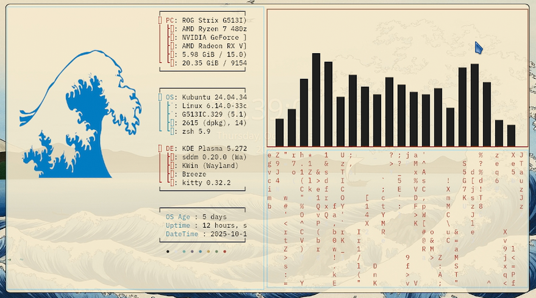

# 🌊 Ukiyo-e Desktop Setup (Kubuntu)

This presentation isn't necessarily to showcase skills, its more about showing how customizable Linux distros can be to those who don't know much about Linux at all. I worked on this setup for quite a bit as I was and still am learning the many things Linux distrobutions can do. Here you'll see a clean, minimalist desktop environment inspired by traditional Japanese woodblock print poster I have in my apartment, namely Katsushika Hokusai's *The Sea at Satta in Suruga Province*. 

The terminal was customized to look like a parchment and ink style workspace, with a borderless terminal configuration, fastfetch, cava and custom artwork. Basically, I wanted learn Linux but still have some fun on the side. 

---

## 🎥 Walkthrough & Demos

This walkthrough will show the terminal I customized, the aplications I was able to match in color theme and at the very end provide the configuration file I used for the kitty terminal emulator, if you enjoy any part of this rice (customization) please feel free to use it for yourself!

### Tiled CLI Workspaces
In the gif you can see on the left fastfetch, top right is cava and bottom right is cmatrix, I thought these looked cool in the reddit posts I saw other users have so I implemented it in my setup, these are all free and can be installed easily. 

.gif)

### Custom Lock Screen
I wanted to match the theme with a cool lock screen so I had this image of a samurai sitting in front of a crt monitor, I would like to change the color of the date & time so it doesn't disappear when I go to put in the password, or maybe place the date & time over the monitor, so it looks like the samurai is checking the time.


---

## 🖼️ Visual Gallery & Component Breakdown

### 1. The Main Desktop Environment

* **Greeting Screen:** 

This is litterally a poster in my place, I thought it looked cool and while first deciding on what to theme my desktop environment this was the second option that came to mind, I took a picture of the poster and had AI generate it 1920 x 1080 so it would fit my background. 


## 2. Applications & More

Beyond core system utilities, the environment maintains the same cohesive aesthetic across primary application workspaces, including media streaming and reading setups.
* **Spotify Layout:** *Spotify with Spicetify to match the color themes*  
* **Custom Firefox Configuration:** 
* **Digital Reading Desk:** *Ebook Viewer On Hand With A Good Book To Read.*  
* **CLI Media Streaming with mpv:** *pulling up videos directly using `mpv` Movie Begins Playing Out Of The Terminal hehe.* .gif)


### 3. Custom Terminal Environment (Kitty)
Driven by the Kitty terminal backend, this interface strips away window borders and title bars for maximum screen real estate. 
* **System Diagnostics:** *Shows detailed system information and core performance layout using custom canvas-colored borders.* 
* **Btop CLI View:** *A graphical, real-time terminal monitor tracking CPU, memory, and processes within*  
* **Tiled Workspace & CLI Panes:** *A split-window workspace utilizing Kitty's native tiling layout.* 
* **CMatrix Theme:** *Terminal matrix stream utilizing matching dark ink tones.*  
---

## 📥 Artwork & Assets Download
If you want to use the standalone custom background and lock screen artwork from this build, you can view and save the high-resolution files below:

* **Primary Wallpaper:** 
* **Second Monitor Screen:** *(A peaceful evening featuring two boats sailing on calm waters)*  
* **Lock Screen Theme (Terminal Samurai):** 
* **Tsunami Profile Picture:** *(Tsunami graphic used for user pfp)*   
* **Fastfetch Wave Asset:** *(A transparent wave graphic used for the CLI fastfetch)*  
  

---

<details>
<summary>📄 Click to view the full kitty.conf file</summary>

```toml
# Hokusai: The Sea at Satta in Suruga Province Theme
# Background and foreground
background #E8DCC2
foreground #1f1f1f

no_titlebar yes

font_family      IBM Plex Mono
bold_font          auto
italic_font        auto
bold_italic_font   auto
font_size 13.0

cursor_shape block
cursor_blink_interval 0
cursor_stop_blinking_after 0
shell_integration no-cursor

scrollback_lines 5000
wheel_scroll_multiplier 3.0
mouse_hide_wait -1

remember_window_size  no
initial_window_width  1200
initial_window_height 750
window_border_width 1.5pt
enabled_layouts tall
window_padding_width 0
window_margin_width 2
hide_window_decorations titlebar-only

enabled_layouts tall,stack

map ctrl+shift+enter new_window
map ctrl+shift+] next_window
map ctrl+shift+[ previous_window
map ctrl+shift+l next_layout
map ctrl+alt+r   goto_layout tall
map ctrl+alt+s   goto_layout stack

cursor #2c6e91
cursor_text_color #ffffff

selection_background #a3cdd9
selection_foreground #1f1f1f

color0  #2e2e2e
color1  #b0493e
color2  #728c69
color3  #c4a45f
color4  #4d8ea3
color5  #7a6e80
color6  #7bb0a8
color7  #dcdcdc

color8  #505050
color9  #c65b51
color10 #8dae7a
color11 #ddc67b
color12 #5ea2b4
color13 #9e85a0
color14 #a2d0c5
color15 #ffffff

tab_bar_style powerline
tab_powerline_style slanted
tab_bar_edge bottom
tab_bar_align left
active_tab_font_style   bold
inactive_tab_font_style normal
active_tab_background   #a3cdd9
active_tab_foreground   #1f1f1f
inactive_tab_background #8B4021
inactive_tab_foreground #E8DCC2
tab_bar_background      #065299

background_opacity 0.90

draw_minimal_borders yes
active_border_color   #8B4021
inactive_border_color #a3cdd9

url_color                #153A1B
